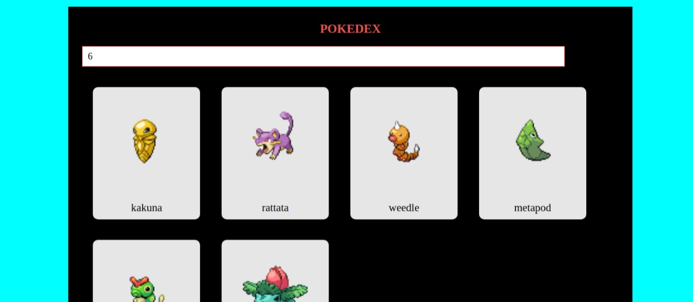

<h1 align="center"> POKEDEX </h1>

  

## 🚀 Tecnologias

Esse projeto foi desenvolvido com as seguintes tecnologias:

- HTML e CSS
- JavaScript
- Git e Github

##  💻Projeto

Pokedex é uma aplicação onde você digita um numero e ela retorna quantidade de pokemons indicada.

- [Acesse o projeto finalizado, online](https://pokedex-sigma-lake.vercel.app/)
